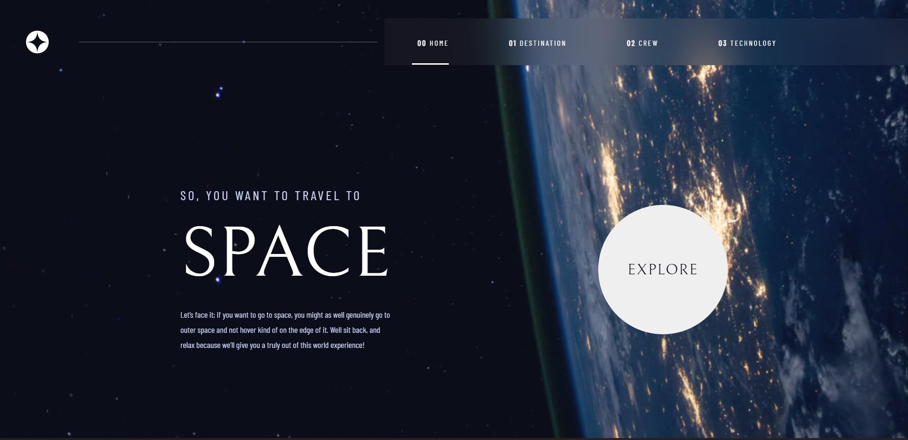

# Frontend Mentor - Space tourism website solution

This is a solution to the [Space tourism website challenge on Frontend Mentor](https://www.frontendmentor.io/challenges/space-tourism-multipage-website-gRWj1URZ3). Frontend Mentor challenges help you improve your coding skills by building realistic projects. 

## Table of contents

- [Overview](#overview)
  - [The challenge](#the-challenge)
  - [Screenshot](#screenshot)
  - [Links](#links)
- [My process](#my-process)
  - [Built with](#built-with)
  - [Continued development](#continued-development)
- [Author](#author)

## Overview

### The challenge

Users should be able to:

- View the optimal layout for each of the website's pages depending on their device's screen size
- See hover states for all interactive elements on the page
- View each page and be able to toggle between the tabs to see new information

### Screenshot

### Links

- Live Site URL: [Link](https://your-live-site-url.com)

## My process

### Built with

- HTML & CSS
- Javascript
- [SwiperJS](https://swiperjs.com/) - Touch Slider  

### Continued development

This project still has a lot of minor bugs, mostly after SwiperJs integration.

I will continue working and finding solutions to fix them.

## Author

- GitHub - [AndriusM5](https://github.com/AndriusM5)
- Frontend Mentor - [@AndriusM5](https://www.frontendmentor.io/profile/AndriusM5)